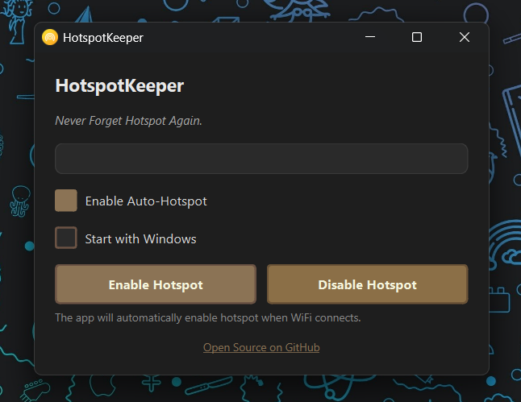

# 🔥 HotspotKeeper

Never forget to enable Windows Mobile Hotspot again.

HotspotKeeper is a lightweight system tray application that automatically enables Mobile Hotspot when your PC connects to WiFi.

---

## ✨ Features

✅ Automatically enables hotspot when WiFi connects  
✅ Runs silently in system tray  
✅ Manual enable/disable controls  
✅ Start with Windows option  
✅ Real-time WiFi & hotspot status  
✅ Lightweight & minimal CPU usage  
✅ Clean modern interface

---

## 🎯 Why HotspotKeeper?

Many users share internet from their laptop to their phone or other devices.  
Sometimes we forget to enable hotspot and end up consuming expensive mobile data.

HotspotKeeper solves this problem automatically.

---

## � Screenshot

---

## �🖥️ Requirements

- Windows 10 / Windows 11
- Administrator permission (for hotspot control)

---

## 📥 Installation

### Option 1 — Installer (Recommended)

1. Download latest release from:
   👉 https://github.com/Moanesbbr/HotspotKeeper/releases

2. Run installer
3. Launch application
4. Done 🎉

---

### Option 2 — Portable EXE

Download and run directly.

---

## ⚙️ Usage

1. Launch HotspotKeeper
2. Enable **Auto-Hotspot**
3. (Optional) Enable **Start with Windows**
4. App will run in system tray automatically

---

## 🧠 How It Works

HotspotKeeper monitors WiFi connectivity.

When WiFi connects:
➡️ Mobile hotspot is enabled automatically

---

## 🔒 Security & Privacy

HotspotKeeper:

- Does NOT collect user data
- Does NOT connect to external servers
- Runs locally only
- Open source and transparent

---

## 🐞 Troubleshooting

### Hotspot not enabling?

- Make sure WiFi is connected
- Run app as Administrator
- Check Windows Mobile Hotspot settings

---

## 🚀 Roadmap

- Auto update system
- Custom hotspot profiles
- Usage statistics
- Multi-language support

---

## 🤝 Contributing

Contributions are welcome!

Feel free to:

- Open issues
- Submit pull requests
- Suggest features

---

## 📄 License

MIT License

---

## 👨‍💻 Author

Moanes Ben Brahim  
Full Stack Developer  
🌐 www.moanesbbr.me
